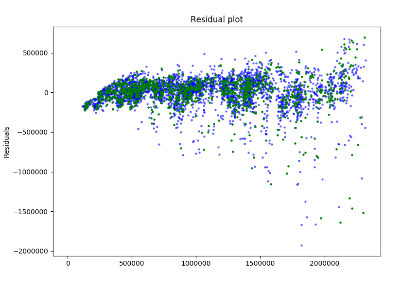
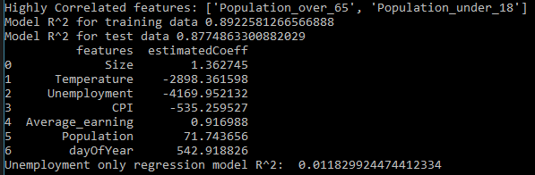

# WoolworthsStoreSalesAnalysis
The conclusion is that the attributes of Unemployment and Temperature were the two consistently strongest correlated variables out of all the attributes, both also being negatively correlated, this was confirmed when plotting Unemployment against Weekly Sales shown below, the line of best fit has a negative gradient which shows its negative correlation with Weekly Sales.

The Residuals of the Linear Model to confirm that the regression formula was randomly centred around zero to indicate little or no bias as shown below, there's further explanation how this plot was generated in the comments of the code.

Of the 13 initial attributes given only 7 (shown in the picture below) were used as inputs into the convolution matrix as many of the features were either categorical, had too much variance or were highly collinear with each other. The thought process on eliminating the noisy data and non meaningful data is written in the comments of the code. The R^2 value for the regression model lay at 0.88. For the plot of Unemployment vs Weekly Sales, the R^2 value was 0.0118.

